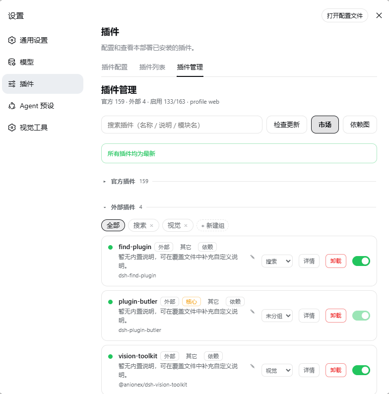
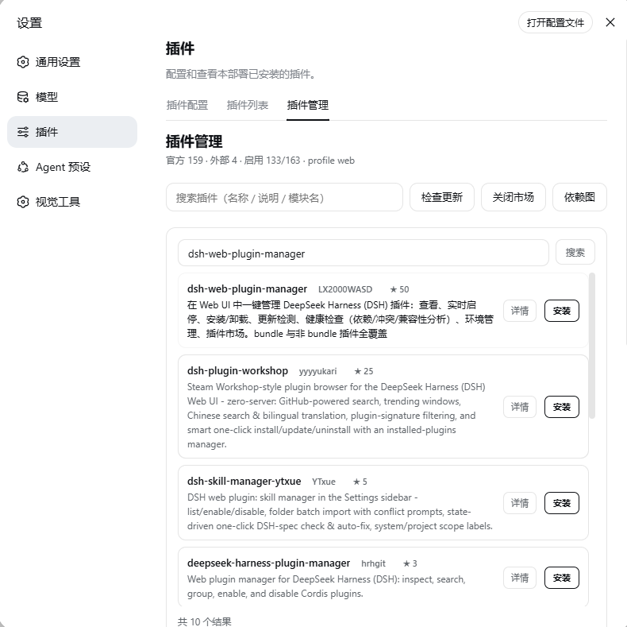
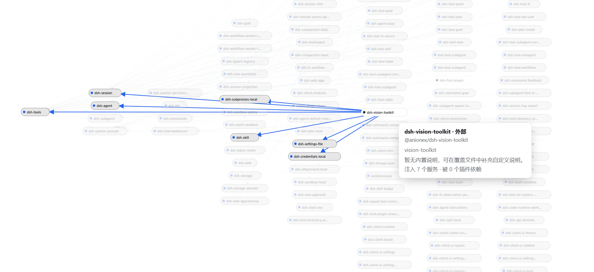

# dsh-plugin-butler

[中文](./README.md) | [English](./README.en.md)

[](LICENSE)
[](https://github.com/imtanhui/dsh-plugin-butler)

**dsh-plugin-butler** (插件管家) is a graphical plugin manager for [DeepSeek Harness](https://github.com/deepseek-ai) (DSH). It lives in the Web settings page and manages every plugin in a profile — a Chinese catalog, one-click toggle (hot-reload), official/external split, custom groups, update check + one-click update (auto-rollback), a plugin market (search / install / uninstall), detail modal (Markdown README), health status, and a full-screen dependency graph. **Zero build, zero runtime dependencies** — only Node builtins plus services the deployment already provides.

> Install the butler first, then install other plugins: afterwards every toggle, update, install and uninstall goes through one UI — toggling is hot-applied, failed updates auto-roll back — which sharply cuts down "installed-and-broke, won't-start" incidents.
>
> If a plugin breaks profile startup: manually clean its `disabled` block in `cordis.patch.yml` or uninstall the dependency, then restart.

## Install

```sh
# Option 1 (recommended): install from GitHub
dsh plugin --profile <name> add github:imtanhui/dsh-plugin-butler

# Option 2: local source (development)
cd /path/to/dsh-plugin-butler
dsh plugin --profile <name> add .
```

After restarting the profile, the Web UI's **Settings → Plugins** shows a "插件管理" (Plugin manager) tab.

## Update

Open **Settings → Plugins → 插件管理** and click **检查更新** (Check updates): it compares each installed npm dependency against the registry `latest` and badges rows with `current → latest`. Click **更新** on a row to upgrade in one click — on failure it automatically rolls back to the previous version. link / file / git sources are marked not auto-updatable.

## Features



| Capability | Description |
|---|---|
| View | Official / external sections (collapsible); a built-in **Chinese catalog** (name + one-line description + category) for 130+ official modules; click a description to edit in place (Save / Ctrl+Enter / Esc), custom overrides saved to `~/.dsh/plugin-manager/catalog.json` with a "自定义" (custom) badge |
| Live toggle | Each row has a switch that **surgically edits** the profile's `cordis.patch.yml` (add/remove a `disabled: true` block) and lets DSH's HMR observer hot-apply it — **no restart**. Core rows (app / transport / services the manager itself needs) are protected; `!!js`-controlled rows are left untouched; other hand-added patch entries are preserved verbatim |
| Custom groups | Organize external plugins into groups (**create / rename / delete / move**), persisted to `~/.dsh/plugin-manager/groups.json`, one-click filter |
| Update check + one-click update | **检查更新** compares the registry `latest` and marks `current → latest`; **更新** re-runs `pnpm add <name>@latest`, auto-rolling back on failure |
| Uninstall | Removes from `dsh.profile.bundles` + `pnpm remove`, rolls back on failure |
| Detail | Detail modal with a hand-written **Markdown README renderer** (zero deps) |
| Health | Failed rows highlighted red + a "只看失败" (show only failed) filter; each row expands to reveal injected services / provider dependencies |



| Capability | Description |
|---|---|
| Plugin market | Searches GitHub `topic:dsh-plugin` repos (star-ranked, paginated); each item shows author / stars / description, with **详情** (details) + **安装** (one-click install) |



| Capability | Description |
|---|---|
| Dependency graph | Full-screen graph: **left-to-right mind-map layout**, nodes show the project name with details on hover; official = blue dot, external = black dot; draggable nodes, hover highlight of the dependency chain, dot-grid canvas, low-opacity thin edges |

## Architecture

- Host: `lib/index.js` — the `PluginManagerGateway` + `/plugin-manager/*` REST routes (GET carries a same-origin guard against CSRF / DNS-rebinding); update / install / uninstall are serialized under a mutex
- Patch editing: `lib/patch.js` — pure helpers (`setRowDisabled` / `parsePatchBlocks` / `githubUrl` / `moduleShortName` …) for adding/removing `disabled` blocks, row-level ops, atomic writes
- Dependency resolution: the Host `list()` resolves injection edges from the Cordis `fiber._store` (`{service: impl}`, where `impl.fiber.entry.options.name` is the provider module) and returns an `edges` array
- Client: `lib/client.js` — hand-written `window.__ModuleLoader__.load` + `React.createElement` (no JSX), registers `settings.plugins.tab` (id `manager`); hand-written Markdown renderer and dependency graph (Sugiyama-style mind-map layout, SVG edges)
- Transport: the official webServer route + same-origin fetch (zero build, zero runtime deps, no Typert Remote)
- State files: Chinese catalog / groups / description overrides live at `~/.dsh/plugin-manager/{catalog.json,groups.json}`

## Known limitations

- Disabling a depended-on entry can fail profile startup (official fail-loud design); recover by removing its `disabled` block from `cordis.patch.yml`
- Core rows are protected and can't be disabled from the UI (edit the config file manually)
- `!!js`-controlled rows are never touched by the UI
- link / file / git dependencies can't be auto-updated (marked as such)
- The market uses the GitHub Search API (60 req/h unauthenticated), which only affects frequent searching
- The dependency graph is a best-effort runtime resolution from `fiber._store`; semantic conflicts are out of scope

## Develop

```sh
pnpm run check   # node --check on the three source files
pnpm test        # node --test (16 pure-function unit tests)
```

> There is no build step: `lib/index.js` / `lib/client.js` / `lib/patch.js` ship as-is (after changing client code, refresh the page / restart the profile).

## Related

- Source & issues: [github.com/imtanhui/dsh-plugin-butler](https://github.com/imtanhui/dsh-plugin-butler)
- Similar project: [dsh-web-plugin-manager](https://github.com/LX2000WASD/dsh-web-plugin-manager)
- License: MIT
